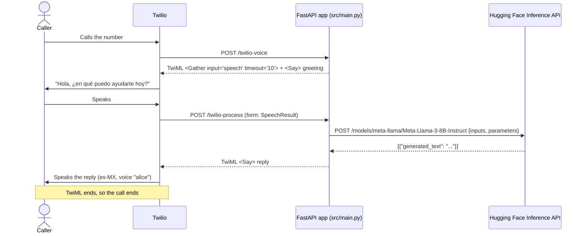

# Architecture

The project is small: one FastAPI module with two HTTP endpoints. There are no layers,
services, queues, or databases. This document only describes how that module works
with the external services it calls.

## Components

| Component | Role | Owned by project? |
|---|---|---|
| **Caller** | Phones the Twilio number | No |
| **Twilio Voice** | Telephony, speech-to-text (`<Gather input="speech">`), text-to-speech (`<Say voice="alice">`) | No (external SaaS) |
| **FastAPI app** (`src/main.py`) | Webhook handler: returns TwiML, builds the prompt, calls the LLM | **Yes** |
| **Hugging Face Inference API** | Hosts `meta-llama/Meta-Llama-3-8B-Instruct` and returns generated text | No (external SaaS) |
| **Railway** | Hosting platform mentioned in the history | No |

## Request flow (one call)

If the caller says nothing within the `<Gather>` timeout, Twilio continues with the next verb and
says *"Lo siento, no escuché nada."* Then the call ends.

## Configuration

| Setting | Where | Value |
|---|---|---|
| `HUGGINGFACE_TOKEN` | Environment variable | Bearer token for Hugging Face |
| Model URL | Hard-coded | `https://api-inference.huggingface.co/models/meta-llama/Meta-Llama-3-8B-Instruct` |
| Generation params | Hard-coded | `max_new_tokens=150`, `temperature=0.7`, `do_sample=True` |
| Voice / language | Hard-coded in TwiML | `alice`, `es-MX` |
| Twilio webhook URL | Twilio console (not in repo) | Inferred: `https://<host>/twilio-voice` |

## Design characteristics (as built)

- **Stateless**: nothing is stored between requests, and the call is not tracked by `CallSid`.
- **Synchronous LLM call inside an async handler**: `requests.post` blocks the event loop
  while waiting for the model.
- **Single turn**: the second response does not contain another `<Gather>`, so there is only one exchange.

These are descriptions of the original design, not recommendations. See
[possible-improvements.md](possible-improvements.md) for commentary.

## Earlier prototype architecture (archived)

`archive/tets2.py` used a different design. It accepted a JSON body, called OpenAI
`gpt-3.5-turbo` for the reply and OpenAI `tts-1` for speech, and wrote an MP3 to
`/tmp/<CallSid>.mp3`. It returned JSON, not TwiML. A code comment says the next step would
be to upload the audio and give Twilio its URL, but that was never built. See
[code-overview.md](code-overview.md#archivetets2py).
